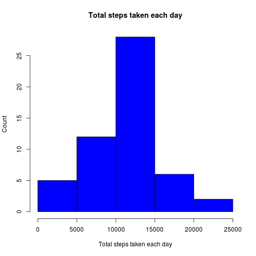
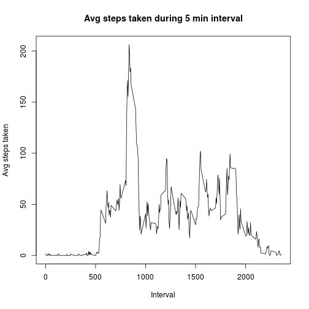
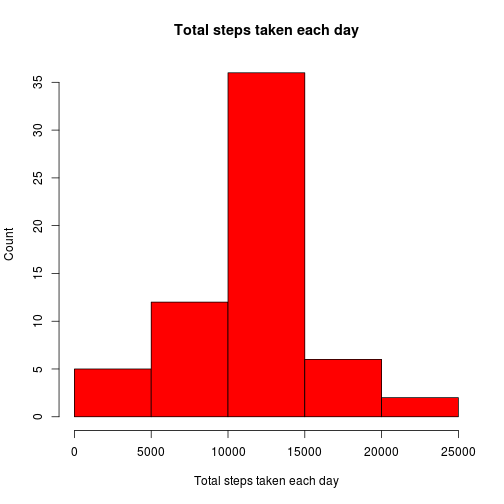
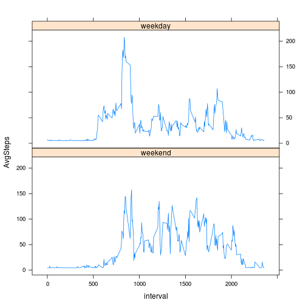

### Loading and preprocessing the data

* Load library to analyse datasets

```r
library(dplyr)
```

* Download and unzip the sample dataset to the working directory.
* Load the dataset

```r
rawdata <- read.csv('activity.csv')
```
* Omitting the NA Values from the dataset

```r
rdata <- na.omit(rawdata)
rdata$date <- as.Date(rdata$date)
```

### What is mean total number of steps taken per day?

1. Calculate the total number of steps per day (use dplyr library)

```r
#Function to Group, Order and summarise bby Day, Ignoring the NA values
stepsperday <- rdata %>% 
  group_by(date) %>% 
  summarize(Total=sum(steps))
```
2. Plotting the Historgram


```r
# Show histogram of steps per day (Frequency->Count)
hist(stepsperday$Total, 
     xlab="Total steps taken each day", 
     ylab="Count", 
     main="Total steps taken each day",
     col=4)
```

 

3. Calculate and Report the Mean and Median Steps per Day

```r
meansteps <- mean(stepsperday$Total,na.rm = TRUE)
print(meansteps)
```

[1] 10766.19

```r
medianstepd <- median(stepsperday$Total, na.rm = TRUE)
print(medianstepd)
```

[1] 10765

### What is the average daily activity pattern?

1. Make a Time series plot on the 5 min intervals as the average steps taken across all days.

```r
#Time series where the Interval is the frequency and the avg steps per interval for each day
timeseriesdata <- rdata %>%
  group_by(interval) %>%
  summarize(AvgSteps=mean(steps))

# Make an average activity plot
plot(timeseriesdata$interval, timeseriesdata$AvgSteps, 
     type="l",
     xlab="Interval",
     ylab="Avg steps taken",
     main="Avg steps taken during 5 min interval")
```

 

### Imputing missing values

1. Calculate and Report Missing Values (NA's)


```r
summary(rawdata)
```

```
##      steps                date          interval     
##  Min.   :  0.00   2012-10-01:  288   Min.   :   0.0  
##  1st Qu.:  0.00   2012-10-02:  288   1st Qu.: 588.8  
##  Median :  0.00   2012-10-03:  288   Median :1177.5  
##  Mean   : 37.38   2012-10-04:  288   Mean   :1177.5  
##  3rd Qu.: 12.00   2012-10-05:  288   3rd Qu.:1766.2  
##  Max.   :806.00   2012-10-06:  288   Max.   :2355.0  
##  NA's   :2304     (Other)   :15840
```

```r
#Cross check for aech variable in the original dataset
colSums(is.na(rawdata))
```

```
##    steps     date interval 
##     2304        0        0
```
2. Strategy to fill missing data

* Replace each NA step value with the mean value and create a new raw dataset


```r
newdata <- rawdata
for(i in 1:ncol(newdata)){
  newdata[is.na(newdata[,i]), i] <- mean(newdata[,i], na.rm = TRUE)
}
```

3. Create a new dataset with filled values


```r
stepsperdaynew <- newdata %>% 
  group_by(date) %>% 
  summarize(Total=sum(steps))
```
4. Plotting the Historgram


```r
# Show histogram of steps per day (Frequency->Count)
hist(stepsperdaynew$Total, 
     xlab="Total steps taken each day", 
     ylab="Count", 
     main="Total steps taken each day",
     col=2)
```

 

5. Compare the data to the earlier dataset


```r
meanstepsnew <- mean(stepsperdaynew$Total,na.rm = TRUE)
print(meanstepsnew)
```

[1] 10766.19

```r
medianstepdnew <- median(stepsperdaynew$Total, na.rm = TRUE)
print(medianstepdnew)
```

[1] 10766.19

#### Conclussion: The mean values is the same but the median is different, therefore my stategy does affect the results.

### Are there differences in activity patterns between weekdays and weekends?

1. Create a new factor variable in the new dataset (NA values replaced with mean)


```r
newdata <- rawdata
for(i in 1:ncol(newdata)){
  newdata[is.na(newdata[,i]), i] <- mean(newdata[,i], na.rm = TRUE)
}

newdata$date <- as.Date(newdata$date)
#create a vector of weekdays
weekdays1 <- c('Monday', 'Tuesday', 'Wednesday', 'Thursday', 'Friday')
#Create the new variable
newdata$wday <- weekdays(newdata$date)
#Use `%in%` and `weekdays` to create a logical vector, convert to `factor` and specify the `levels/labels`
newdata$wday <- factor((weekdays(newdata$date) %in% weekdays1),levels=c(FALSE, TRUE), labels=c('weekend', 'weekday'))
```
Use the Lattice plotting system

```r
library(lattice)
```
Create a new Data set for plotting

```r
timeseriesdata2 <- newdata %>%
  group_by(wday,interval) %>%
  summarize(AvgSteps=mean(steps))
```

2. Make a panel plot with a time series plot


```r
xyplot(AvgSteps ~ interval | wday, 
       type = "l",
       data = timeseriesdata2, 
       layout = c(1,2))
```

 


#### Conclussion: There is a peak in Activity during the week, people might be more busy during the week during working hours.
